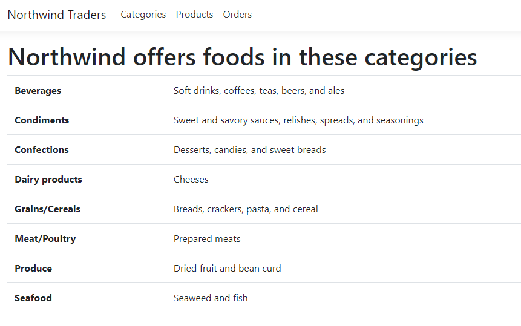
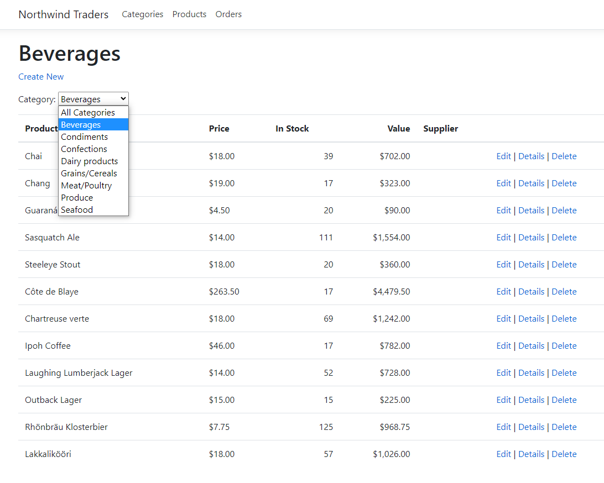
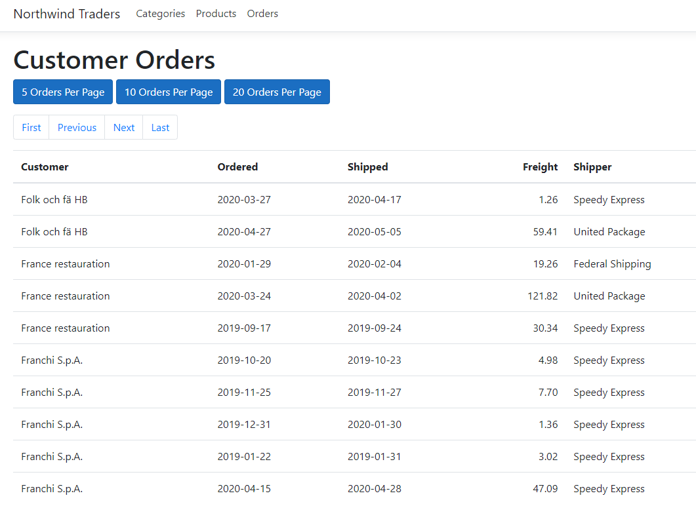

# Northwind Traders
ASP.NET Web-App that manages orders, products, customers, suppliers, and many other aspects of a small business.

This program requires the northwind database that is included, which than connecting to it and retrieves the data to be displayed. It can be modified by the user which includes Creating, Editing, Deleting, and filtering the presented data.

# Requirements
- Microsoft SQL Server
- Create a database, using the SQL code that can be found in the SQL folder

